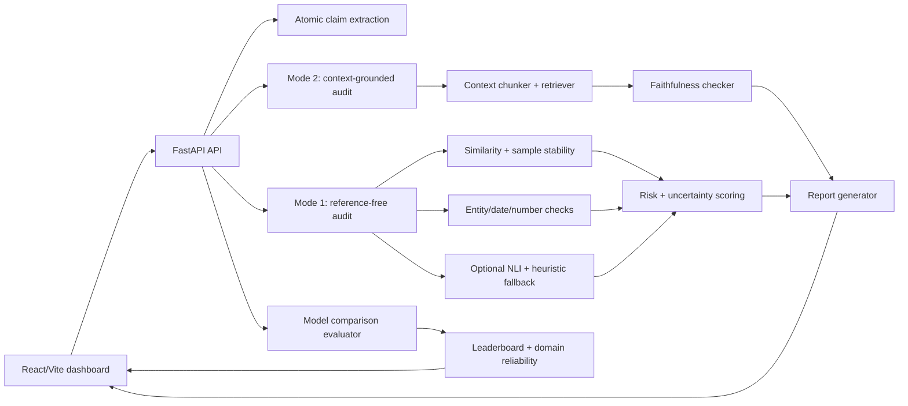

# HalluciGuard AI

Reference-free, context-grounded, and model-comparison hallucination auditing for LLM responses.

HalluciGuard AI is a local research prototype for AI reliability work. It audits any custom LLM answer, not just demo examples, and reports claim-level risk, uncertainty, entity/date/number instability, optional context faithfulness, history, benchmark metrics, and model-wise reliability comparisons. It runs locally without paid APIs.

## Version Roadmap

### v2.0.0: Research/Evaluation Version

- benchmark dataset
- Evaluation Lab
- precision, recall, F1-score
- confusion matrix
- compare scoring methods
- export reports

### v3.0.0 Preview: Model Testing Platform

- compare multiple LLM outputs across the same question set
- test GPT/Gemini/Claude/Perplexity/LLaMA/Mistral/RAG-style outputs
- batch evaluation
- leaderboard
- model-wise hallucination risk
- domain-wise reliability scores

## What Changed in v2

- Custom Analysis is the default workflow.
- Demo cases are editable autofill shortcuts only.
- Sample answers are optional and can be entered as fields, one per line, or separated with `---`.
- API supports full, partial, and limited single-answer analysis modes.
- Atomic claim extraction splits complex sentences into smaller factual claims.
- Optional NLI checker uses `cross-encoder/nli-deberta-v3-small` when available and falls back safely.
- Context-grounded Mode 2 retrieves evidence chunks from pasted context and labels claims as Supported, Contradicted, or Not Enough Evidence.
- Explainable uncertainty breakdown shows sample disagreement, entity instability, semantic variance, and contradiction uncertainty.
- Evaluation Lab runs a 50-case benchmark with accuracy, precision, recall, F1, and confusion matrix metrics.
- Model Lab compares multiple model outputs and ranks average hallucination risk.
- Local history routes store recent reports in JSON.
- JSON export and copy-summary actions are included in the UI.

## Architecture



## Modes

### Mode 1: Reference-Free

Uses alternate sample answers to estimate whether factual claims are stable. It checks semantic similarity, entity/date/number mismatches, contradiction signals, and uncertainty.

Analysis modes:

- `full_reference_free`: 2 or more samples.
- `partial_reference_free`: exactly 1 sample.
- `single_answer_limited`: no samples, internal-only checks with lower confidence.

### Mode 2: Context-Grounded

If context text is pasted, HalluciGuard chunks the context, retrieves matching chunks per claim, and labels each claim:

- Supported
- Contradicted
- Not Enough Evidence

PDF upload is intentionally left as future scope to keep the local MVP lightweight.

## Backend API

`POST /api/analyze`

```json
{
  "question": "Who founded Tesla?",
  "llm_answer": "Tesla was founded by Elon Musk in 2003.",
  "sample_answers": [
    "Tesla was founded in 2003 by Martin Eberhard and Marc Tarpenning.",
    "Elon Musk joined Tesla later as an investor and chairman."
  ],
  "context_text": "Optional pasted source document text."
}
```

Key response fields:

- `analysis_mode`
- `confidence_note`
- `risk_score`
- `risk_level`
- `uncertainty_score`
- `similarity_score`
- `claims`
- `atomic_claims`
- `entity_warnings`
- `uncertainty_breakdown`
- `context_evidence`
- `highlighted_answer`

Other routes:

- `GET /api/health`
- `GET /api/history`
- `DELETE /api/history`
- `GET /api/benchmark/run`

## Frontend

Pages:

- Analyze
- Evaluation Lab
- Model Lab
- History
- Methodology

Analyze includes:

- Custom Analysis tab
- Demo Cases tab
- Question textarea
- LLM answer textarea
- Bulk sample textarea
- Dynamic sample fields
- Optional context textarea
- Risk meter
- Claim table
- Entity warnings
- Uncertainty breakdown
- Context evidence panel
- JSON export and copy summary

## Benchmark

The benchmark file is [benchmarks/hallucination_cases.json](/Users/prii/Desktop/HalluciGuard-AI/benchmarks/hallucination_cases.json) and contains 50 handcrafted supported/hallucinated cases.

The evaluator compares:

- TF-IDF baseline
- embedding similarity
- embedding + entity mismatch
- embedding + entity mismatch + optional NLI/fallback

Metrics:

- accuracy
- precision
- recall
- F1-score
- confusion matrix

Run from the API:

```bash
curl http://localhost:8000/api/benchmark/run
```

## Model Testing Platform

The Model Lab scores the same cases across multiple named model outputs. Users can enter a domain, a question, optional sample answers, select which models to compare, paste each model's answer, and export the comparison report.

Example output:

- GPT average hallucination risk
- Gemini average hallucination risk
- Claude average hallucination risk
- Perplexity average hallucination risk
- Mistral average hallucination risk
- LLaMA average hallucination risk
- RAG Pipeline average hallucination risk

API routes:

- `GET /api/models/compare/demo`
- `POST /api/models/compare`

`POST /api/models/compare` accepts:

```json
{
  "cases": [
    {
      "id": "case-001",
      "domain": "business",
      "question": "Who founded Tesla?",
      "sample_answers": [
        "Tesla was founded by Martin Eberhard and Marc Tarpenning in 2003."
      ],
      "model_outputs": {
        "GPT": "Tesla was founded by Martin Eberhard and Marc Tarpenning in 2003.",
        "Gemini": "Tesla was founded by Elon Musk in 2003.",
        "RAG Pipeline": "Tesla was founded in 2003 by Martin Eberhard and Marc Tarpenning."
      }
    }
  ]
}
```

## Setup

Backend:

```bash
cd backend
python -m venv venv
source venv/bin/activate
pip install -r requirements.txt
uvicorn app.main:app --reload
```

Frontend:

```bash
cd frontend
npm install
npm run dev
```

Fast offline mode:

```bash
cd backend
DISABLE_TRANSFORMERS=true uvicorn app.main:app --reload
```

Local URLs:

- Backend: `http://localhost:8000`
- Frontend: `http://localhost:5173`

## Verification

```bash
cd backend
DISABLE_TRANSFORMERS=true python -m pytest

cd ../frontend
npm run lint
npm run build
```

## Screenshots

Add screenshots here after running locally:

- Analyze page with custom input
- High-risk Tesla demo report
- Context evidence panel
- Evaluation Lab benchmark cards
- History page

## Limitations

- Reference-free scoring detects instability, not absolute truth.
- If all samples repeat the same false claim, risk may be underestimated.
- Optional NLI depends on local model availability and falls back to heuristics.
- Context mode only supports pasted text in v2; PDF parsing is future scope.
- Rule-based atomic splitting is conservative and may not perfectly parse every sentence.
