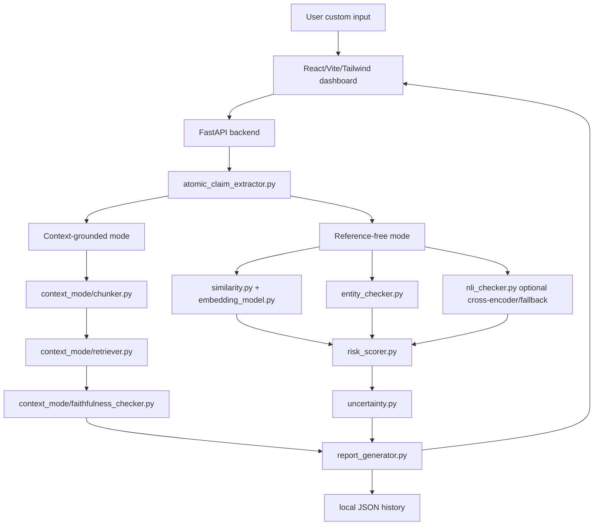

# Architecture: HalluciGuard AI v2

HalluciGuard AI v2 is organized as a local reliability auditing system with two complementary modes.

## Backend

- `preprocessing.py`: whitespace normalization and safe sentence splitting.
- `atomic_claim_extractor.py`: conservative rule-based splitting into smaller factual claims.
- `similarity.py`: claim/sample comparison and sample stability.
- `embedding_model.py`: sentence-transformers when available, local lexical fallback when not.
- `entity_checker.py`: regex fallback extraction for people, dates, numbers, orgs, and locations.
- `nli_checker.py`: optional `cross-encoder/nli-deberta-v3-small`; falls back to the existing heuristic contradiction estimator.
- `uncertainty.py`: explainable uncertainty breakdown.
- `context_mode/`: document loading, chunking, retrieval, and faithfulness labeling.
- `benchmark/evaluator.py`: benchmark metrics and model-strategy comparison.
- `storage/history_store.py`: local JSON-backed history.

## Frontend

Pages:

- Analyze
- Evaluation Lab
- History
- Methodology

The Analyze page defaults to custom input. Demo cases only autofill editable fields. Results show mode badges, risk cards, uncertainty breakdown, context evidence, warnings, claims, export actions, and technical details.
